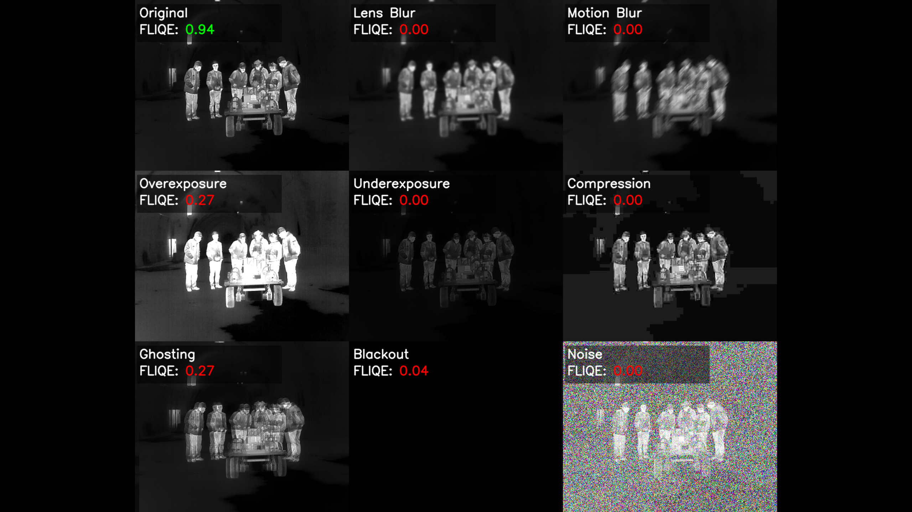

# FLIR Image Quality Estimator (FLIQE)
A tool for evaluating and analyzing image quality from FLIR thermal cameras.

## How it works

FLIQE employs a sophisticated machine learning approach to assess the quality of thermal images from FLIR cameras. The system works through several key stages:

### 1. Feature Extraction with Pre-trained Networks
The system leverages powerful pre-trained computer vision models (ResNet18, ResNet50, and Vision Transformer) as feature extractors. These networks, originally trained on large-scale image datasets, provide robust visual representations that capture important structural and textural patterns in thermal images.

### 2. Contrastive Learning Framework
FLIQE uses supervised contrastive learning to train an embedding space where images with similar quality characteristics are positioned close together, while images with different quality issues are separated. This approach allows the model to learn nuanced quality representations without requiring explicit quality scores for training.

### 3. Comprehensive Distortion Simulation
To train the quality assessment system, FLIQE generates various types of image distortions that commonly affect thermal imagery:
- **Optical distortions**: Lens blur and motion blur that simulate camera movement or focus issues
- **Environmental artifacts**: Gaussian noise representing sensor limitations and thermal interference
- **Exposure problems**: Overexposure and underexposure conditions that affect thermal sensitivity
- **Compression artifacts**: Quality degradation from image compression during storage or transmission
- **Thermal-specific issues**: Ghosting effects and aliasing that are particularly relevant to thermal imaging

### 4. Multi-Stage Quality Assessment
The system operates in two phases:
- **Encoder Training**: Uses contrastive learning to create meaningful feature representations across different distortion types
- **Binary Classification**: Employs a secondary classifier to distinguish between high-quality and distorted images, providing concrete quality scores

### 5. Quality Scoring
FLIQE outputs intuitive quality scores where:
- Higher scores indicate better image quality
- Lower scores suggest the presence of distortions or quality issues
- Scores are normalized to provide consistent interpretation across different image types

### 6. Validation and Visualization
The system includes built-in validation mechanisms using t-SNE visualization to ensure that learned embeddings meaningfully separate different quality levels. This provides interpretable feedback on model performance and helps identify potential issues in quality assessment.
