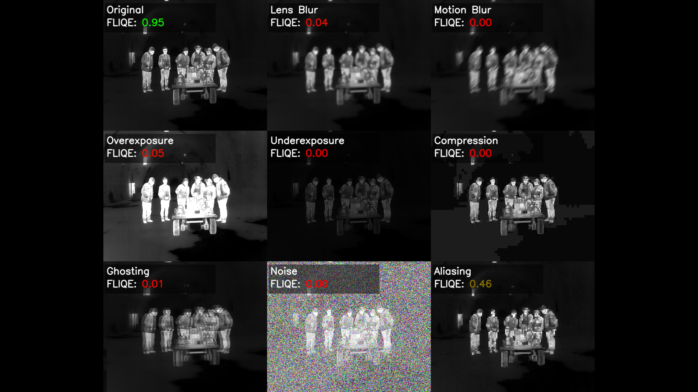

# FLIR Image Quality Estimator (FLIQE)
A tool for evaluating and analyzing image quality from FLIR thermal cameras.



Download pre-trained models:
- [FLIQE Encoder](https://github.com/icsa-hua/FLir-Image-Quality-Estimator/releases/download/uploading_models/resnet50_128_out.pth)
- [FLIQE Encoder + Binary Head](https://github.com/icsa-hua/FLir-Image-Quality-Estimator/releases/download/uploading_models/binary_head.pth)

## How to use
FLIQE implements two classes for image quality estimation:

- **FLIQE class**: takes an image and outputs a quality score.
  ```python
  from flir_iqa import FLIQE

  fliqe = FLIQE(
      quality_model_path='models/encoder_with_binary_head.pth'
  )
  quality_score = fliqe.estimate_image_quality(image)
  print("Image quality score:", quality_score)
  ```

- **OnlineFLIQE class**: allows creating a session and computes a smoothed quality score over a sequence of images.
  ```python
  from flir_iqa import OnlineFLIQE

  online_fliqe = OnlineFLIQE(
      quality_model_path='models/encoder_with_binary_head.pth',
      smoothing_window_size=300
  )
  online_fliqe.create_session('testing_video')
  quality_score = online_fliqe.estimate_smoothed_quality(image, session_id='testing_video')
  print("Smoothed image quality score:", quality_score)
  ```

## How it works
<div align="left">
  
</div>

FLIQE employs a sophisticated machine learning approach to assess the quality of thermal images from FLIR cameras. The system works through 2 main components:

### 1. FLIQE Encoder
The FLIQE Encoder consists of a frozen ResNet50 backbone followed by an adaptive MLP projection head that halves dimensions at each step (2048→1024→512→256→128) and finally outputs a 128-dimensional embedding. The projection head was trained using **supervised contrastive learning** on the [FLIR Thermal Images Dataset](https://www.kaggle.com/datasets/deepnewbie/flir-thermal-images-dataset), learning an embedding space where images with similar quality characteristics are positioned close together, while those with differing quality issues are separated. To effectively train the quality assessment system, FLIQE applies comprehensive distortion simulation, including:
- **Optical distortions**: Lens blur and motion blur that simulate camera movement or focus issues
- **Environmental artifacts**: Gaussian noise representing sensor limitations and thermal interference
- **Exposure problems**: Overexposure and underexposure conditions that affect thermal sensitivity
- **Compression artifacts**: Quality degradation from image compression during storage or transmission
- **Thermal-specific issues**: Ghosting effects and aliasing that are particularly relevant to thermal imaging

The t-SNE representation of the learned embedding space is shown below:


### 2. FLIQE Binary Head 
The FLIQE Binary Head is a lightweight MLP classifier that takes the embeddings produced by the FLIQE Encoder and predicts the quality level of input thermal images. It is trained on a private dataset of FLIR thermal images annotated as either distorted (1) or not (0), using the simulated distortions described above. It outputs logits indicating distortion likelihood. To obtain interpretable quality scores, we apply sigmoid normalization to convert logits to probabilities, then compute the quality score as Q = 1 - P(distortion), ensuring that higher scores correspond to better image quality on a [0,1] scale.

## Evaluation and comparison with other IQA methods
FLIQE was evaluated against several established no-reference image quality assessment (IQA) methods, including statistical-based approaches (BRISQUE, NIQE, PIQE) and deep learning-based methods (ARNIQA, PAQ2PIQ, MUSIQ, DBCNN, CLIPIQA).

The comparison study employed the following approach:
- **Dataset**: [FLIR ADAS v2 thermal images](https://www.kaggle.com/datasets/deepnewbie/flir-thermal-images-dataset) (training and validation sets).
- **Distortions**: Applied 9 different distortion as mentioned above.
- **Binary Classification**: Images classified as either distorted (1) or clean (0).
- **Calibration**: Platt scaling applied to training set to convert quality scores to calibrated probabilities.
- **Metrics**: Accuracy, Precision, Recall, and F1-score evaluated on the validation set.

The comparative evaluation demonstrates FLIQE's superior performance across all metrics:

| Algorithm | Accuracy | Precision | Recall | F1-Score |
|-----------|----------|-----------|--------|----------|
| **FLIQE** | **0.859** | **0.898** | **0.773** | **0.831** |
| ARNIQA    | 0.810     | 0.813     | 0.748  | 0.779    |
| BRISQUE   | 0.821     | 0.887     | 0.688  | 0.774    |
| NIQE      | 0.789     | 0.814     | 0.686  | 0.744    |
| PIQE      | 0.792     | 0.883     | 0.617  | 0.726    |
| DBCNN     | 0.736     | 0.717     | 0.678  | 0.697    |
| PAQ2PIQ   | 0.743     | 0.752     | 0.635  | 0.689    |
| MUSIQ     | 0.729     | 0.713     | 0.660  | 0.686    |
| CLIPIQA   | 0.716     | 0.700     | 0.639  | 0.668    |

*Note: Run the 'comparison' notebook to populate the actual metric values*

## Limitations and Future Work
While FLIQE demonstrates strong performance in assessing the quality of FLIR thermal images, there are several limitations and areas for future improvement:
- **Dataset Diversity**: The synthetic distortions may not encompass the full range of real-world distortions encountered in various environments.
- **Model Generalization**: Further validation on diverse datasets from different FLIR camera models and settings is needed to ensure robustness. For example, testing on real-world distorted images captured in various conditions or using different [FLIR Thermal Color Palettes](https://www.flir.com/discover/industrial/picking-a-thermal-color-palette/?srsltid=AfmBOorLoCf_-y7ndgyb5wE0mGTtHrj9DXKc4MlLT0MxNcGEh_WaGVGq).


## Integration with RTSP and Kafka

FLIQE provides a REST API for real-time image quality monitoring of RTSP video streams, with automatic publishing of quality metrics to Apache Kafka. This integration enables continuous quality assessment of live thermal camera feeds in production environments.

The API processes frames from an RTSP video source (such as an Axis camera), estimates image quality using the OnlineFLIQE model, and broadcasts both raw and smoothed quality scores to a specified Kafka topic. This allows downstream systems to monitor thermal image quality in real-time and trigger alerts or actions based on quality degradation.

### API Endpoints
The service exposes three REST endpoints:
- **POST /start**: Initiates the RTSP to Kafka processing pipeline. Accepts optional configuration parameters for the video source URI, Kafka topic name, and smoothing window size. Returns the active configuration upon successful startup.
- **POST /stop**: Gracefully terminates the running processing pipeline, releasing video capture resources and stopping Kafka message production.
- **GET /status**: Returns the current state of the processor, including whether it is running or stopped, along with the active configuration details (video URI, Kafka topic, and smoothing window).

### Configuration Parameters
The processing pipeline can be configured with the following parameters:

| Parameter | Description | Default |
|-----------|-------------|---------|
| **video_uri** | The RTSP stream URL of the thermal camera | Axis camera endpoint |
| **kafka_topic** | The Kafka topic where quality scores are published | `image-quality-data` |
| **smoothing_window** | Number of frames used for calculating the smoothed quality score | 150 |

### Kafka Message Format

Each message published to Kafka contains the following information:

| Field | Description |
|-------|-------------|
| **timestamp** | UTC timestamp of the quality measurement in ISO 8601 format |
| **smoothing_window** | The configured smoothing window size |
| **raw_image_quality** | The instantaneous quality score for the current frame |
| **smoothed_image_quality** | The averaged quality score over the smoothing window |

### Security

The Kafka integration supports SSL/TLS encryption for secure communication with the Kafka cluster. Certificate-based authentication is used, requiring the following certificate files in the `kafka_certificates` directory:

- **signed.key**: Private key for client authentication
- **signed.pem**: Signed client certificate
- **trusted_authority.cert**: Certificate authority for server verification

### Running the API

The API server can be launched using Docker Compose or directly via Uvicorn. Once running, the service listens on port 8000 and provides OpenAPI documentation at the `/docs` endpoint for interactive exploration of the available endpoints.